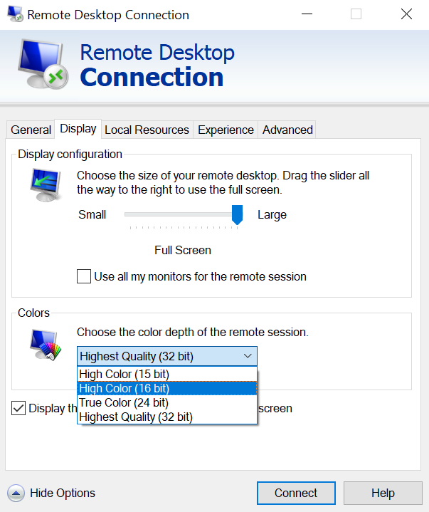

# Windows-2-Linux-Remote-Dekstop
W2L sets up a xrdp server on Linux which is reachable via Windows RDP.

## Linux Host
Quick setup 
```bash
wget -O - https://b0-b.github.io/Windows-2-Linux-Remote-Dekstop/w2l.sh | bash
```

## Windows Host
Go to Windows `Remote Desktop Connection` under `display` > `color` and change settings to 16bit to get max. performance.

 